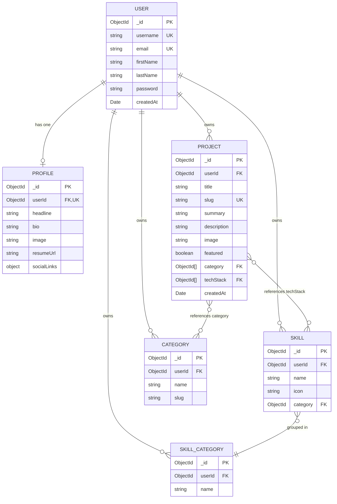
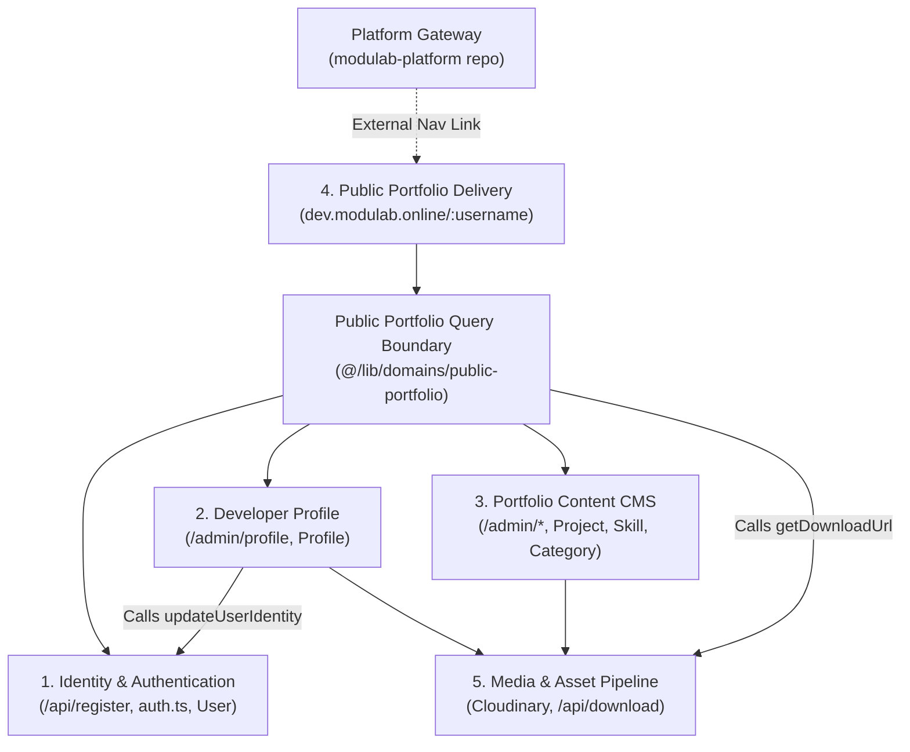
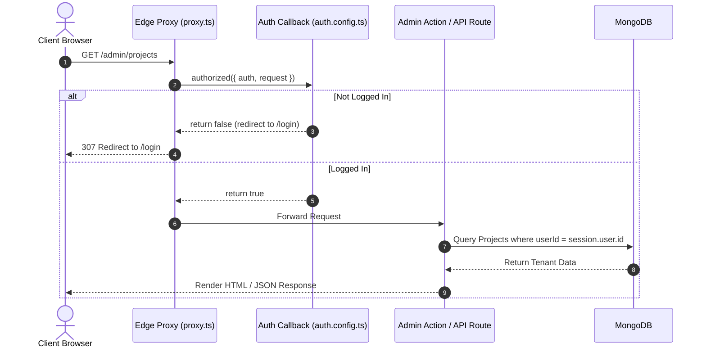
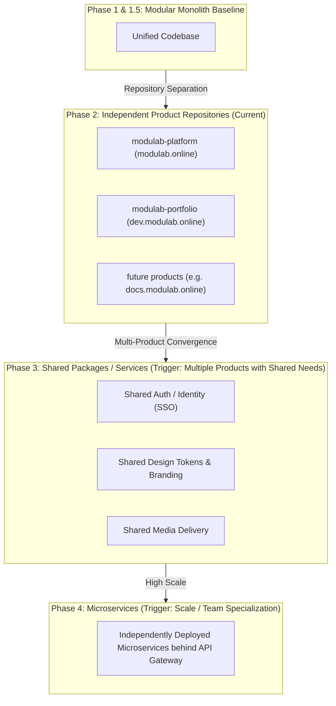

# Modulab Portfolio Architecture

> **System Overview**: Comprehensive documentation of the Modulab Portfolio product application (`dev.modulab.online`), its domain boundaries, routing, data ownership, write isolation rules, authentication boundaries, and the planned evolution strategy within the Modulab ecosystem.

---

## 1. System Context & Entity Boundaries

```mermaid
graph TD
    subgraph PlatformEcosystem["Modulab Platform Ecosystem"]
        PlatformGateway["Modulab Platform Repository (modulab.online)<br/>Brand, Mission, Product Directory"]
    end

    subgraph ProductPortfolio["Modulab Portfolio Repository (dev.modulab.online)"]
        PortfolioLanding["Portfolio Showcase (/)<br/>Product Marketing & Onboarding"]
        PortfolioCMS["Portfolio Studio / CMS (/admin)<br/>Projects, Skills, Categories, Profile"]
        PublicRenderer["Dynamic Portfolio Engine (/[username])<br/>Public Tenant Portfolios"]
        PublicQueryBoundary["Public Portfolio Query Boundary<br/>(@/lib/domains/public-portfolio)"]
        AuthSystem["Identity & Auth (/login, /api/auth, /api/register)"]
    end

    subgraph ExternalServices["External Infrastructure"]
        MongoDB[("MongoDB Database<br/>(Cluster0 / portfolio)")]
        Cloudinary[("Cloudinary Media CDN<br/>(Modulab/{username}/*)")]
    end

    PlatformGateway -.->|Cross-repo link (NEXT_PUBLIC_PORTFOLIO_URL)| PortfolioLanding
    AuthSystem --> MongoDB
    PortfolioCMS --> MongoDB
    PortfolioCMS --> Cloudinary
    PublicRenderer --> PublicQueryBoundary
    PublicQueryBoundary --> MongoDB
    PublicQueryBoundary --> Cloudinary
```

### Core Terminology & Boundaries

* **Modulab**: The parent brand and umbrella developer platform ("The Operating System for Developers"). Managed in the independent `modulab-platform` repository (`modulab.online`).
* **Modulab Portfolio**: The premier product application built within the Modulab ecosystem. It is a full-featured, multi-tenant Portfolio CMS and public profile generator hosted in this repository (`modulab-portfolio`) and deployed at `dev.modulab.online`.
* **Current Implementation**: A unified **Modular Monolith** built on Next.js 16 App Router, serving all portfolio product capabilities, admin CMS, dynamic portfolios, authentication, and media integrations.

---

## 2. Routing Architecture

The routing topology is managed at the edge through [`src/proxy.ts`](file:///home/harish/Harish/Git/Modulab/src/proxy.ts) and [`src/auth.config.ts`](file:///home/harish/Harish/Git/Modulab/src/auth.config.ts).

```mermaid
flowchart TD
    Req([Incoming HTTP Request]) --> Proxy["Proxy Router (src/proxy.ts)"]

    Proxy --> AuthCheck{Logged in?}
    AuthCheck -->|Visiting /login or /register & Logged in| RedirectAdmin["Redirect to /admin"]
    AuthCheck -->|Otherwise| PassRoute["Pass Through to Next.js Routes"]

    PassRoute --> PathRoute{Path}
    PathRoute -->|/| PortfolioLanding["Portfolio Landing (src/app/page.tsx)"]
    PathRoute -->|/admin/*| CMSProtected["CMS Dashboard & Managers (Auth-Gated)"]
    PathRoute -->|/login, /register| AuthPages["Auth & Registration (Public)"]
    PathRoute -->|/api/*| APIRoutes["API Handlers (auth, media, register, download)"]
    PathRoute -->|/[username]| DynamicPortfolio["Resolve to src/app/[username]/page.tsx"]
```

### Route Mapping & Responsibilities

| Path | Target Surface | Permitted Behavior | Auth Required |
| :--- | :--- | :--- | :--- |
| `/` | **Portfolio Landing** | Product marketing, feature overview, onboarding | No |
| `/[username]` | **Public Portfolios** | Dynamic server-rendered developer portfolios | No |
| `/admin/*` | **Portfolio Studio CMS** | Project CRUD, skill matrix, categories, profile | Yes (Redirects to `/login`) |
| `/login` | **Authentication** | Sign-in & sign-up modal / form | No (Redirects to `/admin` if logged in) |
| `/api/auth/*` | **NextAuth Handlers** | Session verification, sign-in, JWT callbacks | No |
| `/api/register` | **User Registration** | Public tenant registration | No |
| `/api/v1/media/presign` | **Upload Authorization** | Generates signed Cloudinary upload params | Yes |
| `/api/download` | **Asset Proxy** | Secure streaming proxy for attachments | No |

---

## 3. Major Application Modules

### 3.1 Portfolio Product Landing (`src/app/page.tsx`)
* **Purpose**: Marketing and onboarding page for the Modulab Portfolio product.
* **Key Components**: Feature highlights, technology stack overview, dashboard preview mockups, direct call-to-actions to `/login`.


### 3.3 Dynamic Portfolio Engine (`src/app/[username]/`)
* **Purpose**: Server-rendered, highly optimized public portfolio page for any registered developer tenant.
* **Key Components**:
  * [`src/app/[username]/page.tsx`](file:///home/harish/Harish/Git/Modulab/src/app/%5Busername%5D/page.tsx): Thin Server Component invoking the canonical in-process query helper `getPublicPortfolioData(username)` from `@/lib/domains/public-portfolio`.
  * [`src/app/[username]/PortfolioClient.tsx`](file:///home/harish/Harish/Git/Modulab/src/app/%5Busername%5D/PortfolioClient.tsx): Client Component rendering hero, project filter tabs, modal dialogs, and responsive navigation from serialized props.
  * Metadata Generator: Dynamically populates SEO `title` and `description` from the domain query result.

### 3.4 Portfolio Studio / CMS (`src/app/admin/`)
* **Purpose**: Authenticated dashboard where developers curate their professional identity.
* **Sub-Modules**:
  * **Dashboard (`/admin`)**: Aggregated metrics (total projects, featured count, profile completeness status, quick actions).
  * **Projects Manager (`/admin/projects`, `/admin/projects/new`, `/admin/projects/edit/[id]`)**: Full CRUD for projects, Cloudinary thumbnail uploads, slug validation, tech stack association, and rich-text descriptions.
  * **Categories Manager (`/admin/categories`)**: Dynamic category management for project taxonomy.
  * **Skills Manager (`/admin/skills`)**: Skill catalog management with integrated Devicon SVG search and category grouping.
  * **Profile Settings (`/admin/profile`)**: Bio, headline, social links, profile photo, and resume upload with proxy download capabilities.

### 3.5 Identity & Authentication Engine
* **Purpose**: Shared authentication provider across platform and product surfaces.
* **Implementation**: NextAuth.js v5 (`auth.ts`, `auth.config.ts`) using credentials provider with bcrypt password hashing.

### 3.6 Media & Asset Delivery Pipeline (`src/lib/domains/media/`, `src/app/api/v1/media/presign`, `src/app/api/download/`)
* **Purpose**: Hierarchical Cloudinary image transformation, presigned direct browser uploads, and secure resume downloads.
* **Namespace**: `Modulab/{username}/{category}` where category is `Profile_Photos`, `Resumes`, or `Project_Images`.

---

## 4. Data Ownership & Write Isolation Rules

All persistence is managed in MongoDB via Mongoose schemas under [`src/models/`](file:///home/harish/Harish/Git/Modulab/src/models/).



### 4.1 Data Ownership Matrix

| Model | Exclusively Owned By | Allowed Writers | Allowed Direct Readers | Notes |
| :--- | :--- | :--- | :--- | :--- |
| [`User`](file:///home/harish/Harish/Git/Modulab/src/models/User.ts) | **Identity & Authentication** | Identity Domain only (`/api/register`, `updateUserIdentity`) | Identity Domain (`auth.ts`, `updateUserIdentity`), Public Portfolio Query Boundary | Tenant Root Entity |
| [`Profile`](file:///home/harish/Harish/Git/Modulab/src/models/Profile.ts) | **Developer Profile** | Profile Domain only (`profile/actions.ts`) | Profile Domain (`getProfile.ts`), Public Portfolio Query Boundary | Tenant Personalization |
| [`Project`](file:///home/harish/Harish/Git/Modulab/src/models/Project.ts) | **Portfolio Content CMS** | Portfolio CMS only (`projects/actions.ts`) | Portfolio CMS (`queries.ts`, manager actions), Public Portfolio Query Boundary | Showcase Item |
| [`Skill`](file:///home/harish/Harish/Git/Modulab/src/models/Skill.ts) | **Portfolio Content CMS** | Portfolio CMS only (`skills/actions.ts`) | Portfolio CMS (`queries.ts`, manager actions), Public Portfolio Query Boundary | Technology Matrix |
| [`SkillCategory`](file:///home/harish/Harish/Git/Modulab/src/models/SkillCategory.ts) | **Portfolio Content CMS** | Portfolio CMS only (`skills/actions.ts`) | Portfolio CMS (`queries.ts`, manager actions), Public Portfolio Query Boundary | Skill Grouping |
| [`Category`](file:///home/harish/Harish/Git/Modulab/src/models/Category.ts) | **Portfolio Content CMS** | Portfolio CMS only (`categories/actions.ts`) | Portfolio CMS (`queries.ts`, manager actions), Public Portfolio Query Boundary | Project Taxonomy |

### 4.2 Write Isolation & Cross-Domain Mutation Rules

1. **Strict Single-Writer Rule**: Every Mongoose model has exactly **one** owning domain. Only code located within the owning domain may execute mutations (`save()`, `create()`, `findOneAndUpdate()`, `findByIdAndUpdate()`, `deleteOne()`, `findOneAndDelete()`) on that model.
2. **User Model Write Isolation**:
   - The [`User`](file:///home/harish/Harish/Git/Modulab/src/models/User.ts) model is exclusively owned by **Identity & Authentication**.
   - **NO other domain** (including Developer Profile or Portfolio CMS) may directly import or mutate the `User` model.
   - Any profile-initiated identity update (e.g. updating `firstName`, `lastName`, or `username`) must call an explicit in-process domain boundary helper: [`src/lib/domains/identity/updateUserIdentity.ts`](file:///home/harish/Harish/Git/Modulab/src/lib/domains/identity/updateUserIdentity.ts).
3. **Public Engine Read-Only Invariant**: The **Public Portfolio Delivery Engine** (`src/app/[username]/`) is strictly read-only, owns zero persistent models, and consumes data exclusively through the dedicated in-process Public Portfolio Query Boundary (`getPublicPortfolioData` in `@/lib/domains/public-portfolio`).
4. **Media Supporting Role**: The **Media & Asset Pipeline** owns all direct interactions with Cloudinary SDKs and APIs. Domain Server Actions interact with media via dedicated helpers.
5. **Cross-Domain Communication Principle**: In the Phase 1.5 modular monolith, cross-domain interactions MUST pass through formal domain boundary modules under `src/lib/domains/<domain>/` rather than directly importing another domain's Mongoose models. Domain ownership applies to both persistence and access boundaries: read-only consumers consume published domain query helpers rather than querying foreign models directly.

---

## 5. Domain Boundary Inventory



### 1. Identity & Authentication Domain
* **Responsibility**: User identity, credential registration, password hashing, JWT minting/verification, username reservation, tenant root security.
* **Owned Models / Data**: [`User`](file:///home/harish/Harish/Git/Modulab/src/models/User.ts) model (`users` collection).
* **Allowed Dependencies**: [`src/lib/db.ts`](file:///home/harish/Harish/Git/Modulab/src/lib/db.ts), `bcryptjs`, `next-auth`.
* **Prohibited Dependencies**: Profile model, Project model, Skill model, Cloudinary SDK.
* **Future Extraction Target**: `identity-service` (OAuth2 / OIDC SSO Service when multi-product auth is required).

### 2. Developer Profile Domain
* **Responsibility**: Developer bio, professional headline, avatar, resume lifecycle, social profiles.
* **Owned Models / Data**: [`Profile`](file:///home/harish/Harish/Git/Modulab/src/models/Profile.ts) model (`profiles` collection).
* **Allowed Dependencies**: Identity domain helper (`updateUserIdentity`), Media domain utilities, shared UI.
* **Prohibited Dependencies**: Direct `User` model imports, direct Project/Skill/Category mutations.
* **Future Extraction Target**: `profile-service` (or merged into `portfolio-service`).

### 3. Portfolio Content Management Domain (Portfolio Studio / CMS)
* **Responsibility**: Portfolio project authoring, category taxonomy, skill matrix, rich-text curation, dashboard metrics.
* **Owned Models / Data**: [`Project`](file:///home/harish/Harish/Git/Modulab/src/models/Project.ts), [`Category`](file:///home/harish/Harish/Git/Modulab/src/models/Category.ts), [`Skill`](file:///home/harish/Harish/Git/Modulab/src/models/Skill.ts), [`SkillCategory`](file:///home/harish/Harish/Git/Modulab/src/models/SkillCategory.ts).
* **Allowed Dependencies**: Identity session (`session.user.id`), Media pipeline, shared UI, rich-text components.
* **Prohibited Dependencies**: Direct `User` mutations, Direct `Profile` mutations.
* **Future Extraction Target**: `portfolio-service` (Core Portfolio CMS Service).

### 4. Public Portfolio Delivery Domain
* **Responsibility**: High-speed public rendering of tenant portfolios, dynamic SEO/OpenGraph metadata generation, client-side project filtering, sanitized HTML display.
* **Owned Models / Data**: None (Pure Read Model / Projection).
* **Access Boundary**: Consumes the in-process query boundary [`src/lib/domains/public-portfolio/`](file:///home/harish/Harish/Git/Modulab/src/lib/domains/public-portfolio/) (`getPublicPortfolioData`).
* **Allowed Dependencies**: Public portfolio query helper (`getPublicPortfolioData`), `DOMPurify`, UI components.
* **Prohibited Dependencies**: Direct Mongoose model imports (`User`, `Profile`, `Project`, `Skill`, `SkillCategory`, `Category`), `src/lib/db`, any write/mutation operations, Server Actions, auth modification.
* **Future Extraction Target**: `portfolio-renderer` (Edge SSR / Static Rendering Micro-Frontend consuming `GET /api/v1/public/portfolios/:username`).

### 5. Media & Asset Pipeline (Technical Capability Domain)
* **Responsibility**: Cloudinary folder hierarchization (`Modulab/{username}/{category}`), dynamic transformation URLs (`getOptimizedImageUrl`), authorized signed download streaming for attachments (`/api/download`).
* **Owned Models / Data**: Cloudinary storage namespaces and delivery configurations.
* **Allowed Dependencies**: Cloudinary Node SDK, `src/lib/utils.ts`.
* **Prohibited Dependencies**: Application database models, domain business rules.
* **Future Extraction Target**: `media-service` (Presigned Upload & Asset Processing Service).

---

## 6. Authentication & Authorization Boundary



### Key Security Protocols
* **Authentication Gating**: Admin routes (`/admin/*`) are restricted to authenticated sessions via `auth.config.ts`. Unauthenticated callers are redirected to `/login`.
* **Server Action Authorization**: Every mutation server action ([`src/app/admin/projects/actions.ts`](file:///home/harish/Harish/Git/Modulab/src/app/admin/projects/actions.ts), [`src/app/admin/categories/actions.ts`](file:///home/harish/Harish/Git/Modulab/src/app/admin/categories/actions.ts), [`src/app/admin/skills/actions.ts`](file:///home/harish/Harish/Git/Modulab/src/app/admin/skills/actions.ts), [`src/app/admin/profile/actions.ts`](file:///home/harish/Harish/Git/Modulab/src/app/admin/profile/actions.ts)) invokes `await auth()` internally and rejects unauthenticated callers before executing queries.

---

## 7. Planned Architectural Evolution



### Evolution Stages & Decision Triggers

| Stage | Topology | Operational Model | Trigger Condition |
| :--- | :--- | :--- | :--- |
| **Phase 2 (Current)** | **Independent Repositories** | Independent Next.js repositories (`modulab-platform`, `modulab-portfolio`) with dedicated deployment lifecycles. | Current baseline. |
| **Phase 3 (Planned)** | **Shared Packages / Services** | Shared packages (`packages/ui`, `packages/auth`) or centralized SSO service across products. | When multiple products require shared authentication or unified navigation. |
| **Phase 4 (Future)** | **Microservices Ecosystem** | Distributed independently deployable services behind an API Gateway with dedicated databases. | When individual services require independent scaling, distinct technology stacks, or separate team deployment lifecycles. |

---

## 8. Architectural Constraints & Invariants

1. **Portfolio Independence**: Public user portfolios must remain served at `dev.modulab.online/[username]` without path prefix collisions.
2. **Deterministic Hydration**: All dates rendered across server and client components must format with explicit `timeZone: 'UTC'` using [`formatDate`](file:///home/harish/Harish/Git/Modulab/src/lib/utils.ts#L28-L37).
3. **Data Integrity**: Database model names (`User`, `Profile`, `Project`, `Skill`, `Category`, `SkillCategory`) and Cloudinary storage paths (`Modulab/...`) must remain stable to prevent breaking existing data.
4. **Standard API Response Format**: All route handlers and server actions must conform to `{ success: boolean, data?: any, error?: string }`.
5. **Ownership Precedes Extraction**: A future service may only own data and mutations that already have a clearly established, isolated owner in the modular monolith.
