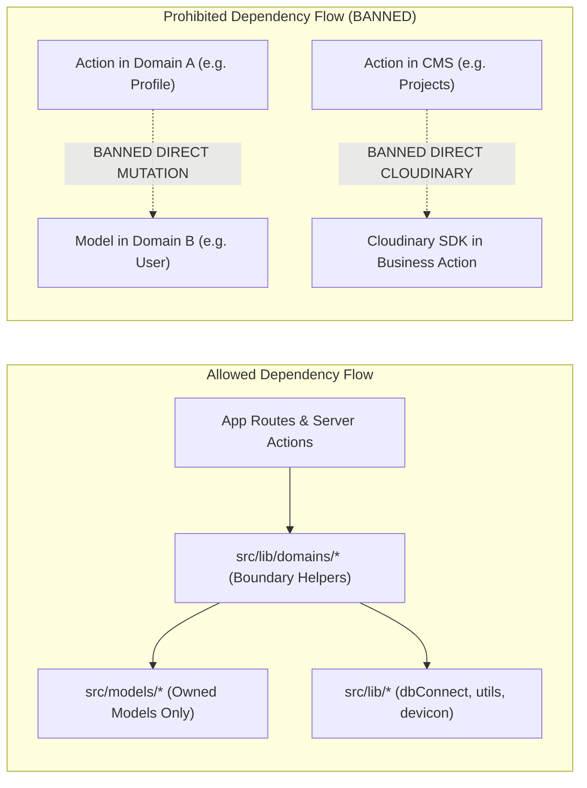

# Modulab Domain Boundaries Reference

> **Canonical Developer Guide**: Rules of engagement for module boundaries, data ownership, cross-domain imports, and in-process service helpers within the Modulab modular monolith.

---

## 1. Domain Map & Architecture Overview

```mermaid
graph TD
    subgraph Layer1["1. Gateway Layer"]
        PlatformDomain["Platform Gateway Domain<br/>(modulab.online/platform)"]
    end

    subgraph Layer2["2. Core Domain Services"]
        IdentityDomain["Identity & Authentication Domain<br/>(User, /api/register, auth.ts)"]
        ProfileDomain["Developer Profile Domain<br/>(Profile, /admin/profile)"]
        CMSDomain["Portfolio Content CMS Domain<br/>(Project, Category, Skill, SkillCategory, /admin/*)"]
    end

    subgraph Layer3["3. Public Delivery Layer"]
        PublicRenderer["Public Portfolio Delivery Engine<br/>(dev.modulab.online/:username)"]
    end

    subgraph Layer4["4. Infrastructure Supporting Domain"]
        MediaDomain["Media & Asset Pipeline<br/>(Cloudinary, /api/download)"]
    end

    PlatformDomain -.->|External Link| PublicRenderer
    ProfileDomain -->|Calls updateUserIdentity()| IdentityDomain
    ProfileDomain --> MediaDomain
    CMSDomain --> MediaDomain
    PublicRenderer -->|Read Aggregation| IdentityDomain
    PublicRenderer -->|Read Aggregation| ProfileDomain
    PublicRenderer -->|Read Aggregation| CMSDomain
```

---

## 2. Domain Ownership Matrix

| Domain Name | Primary Responsibility | Owned Models | Owned Routes / Pages | Owned Storage / Infrastructure |
| :--- | :--- | :--- | :--- | :--- |
| **1. Platform Gateway** | Platform marketing, ecosystem directory, mission presentation | *None* | `/platform`, `/` (redirect) | Static edge assets |
| **2. Identity & Authentication** | User credentials, registration, password hashing, JWT tokens, username reservation | [`User`](file:///home/harish/Harish/Git/Modulab/src/models/User.ts) | `/login`, `/api/register`, `/api/auth/*` | `users` MongoDB collection |
| **3. Developer Profile** | Developer bio, headline, avatar, resume lifecycle, social profiles | [`Profile`](file:///home/harish/Harish/Git/Modulab/src/models/Profile.ts) | `/admin/profile` | `profiles` MongoDB collection |
| **4. Portfolio Content CMS** | Portfolio project authoring, taxonomy categories, technical skill matrix, dashboard metrics | [`Project`](file:///home/harish/Harish/Git/Modulab/src/models/Project.ts), [`Category`](file:///home/harish/Harish/Git/Modulab/src/models/Category.ts), [`Skill`](file:///home/harish/Harish/Git/Modulab/src/models/Skill.ts), [`SkillCategory`](file:///home/harish/Harish/Git/Modulab/src/models/SkillCategory.ts) | `/admin`, `/admin/projects/*`, `/admin/categories`, `/admin/skills` | `projects`, `categories`, `skills`, `skillcategories` MongoDB collections |
| **5. Public Portfolio Delivery** | Read-optimized public rendering, dynamic SEO/OpenGraph tags, HTML sanitization | *None (Read Projection)* | `/[username]` | Edge CDN cache |
| **6. Media & Asset Pipeline** | Image optimization, CDN hierarchization, signed resume download stream | *None* | `/api/download` | `Modulab/{username}/*` Cloudinary namespace |

---

## 3. Allowed vs. Prohibited Dependency Directions



### Specific Import Rules

| Calling Location | Allowed Imports | Prohibited Imports |
| :--- | :--- | :--- |
| **`src/app/admin/profile/*`** | • `@/models/Profile`<br/>• `@/lib/domains/identity` (`updateUserIdentity`, `getUserIdentity`)<br/>• `@/lib/domains/media` / `@/lib/domains/media/client`<br/>• `@/lib/utils` | ❌ `import User from '@/models/User'` *(Prohibited)*<br/>❌ Direct writes to `User` collection |
| **`src/app/admin/projects/*`** | • `@/models/Project`<br/>• `@/models/Category`<br/>• `@/models/Skill`<br/>• `@/lib/domains/media` / `@/lib/domains/media/client`<br/>• `@/lib/utils` | ❌ `@/models/User`<br/>❌ `@/models/Profile`<br/>❌ Direct mutations to non-CMS models |
| **`src/app/admin/skills/*`** | • `@/models/Skill`<br/>• `@/models/SkillCategory`<br/>• `@/lib/devicon`<br/>• `@/lib/utils` | ❌ `@/models/User`<br/>❌ `@/models/Project`<br/>❌ `@/models/Profile` |
| **`src/app/admin/categories/*`** | • `@/models/Category`<br/>• `@/lib/utils` | ❌ `@/models/User`<br/>❌ `@/models/Project` |
| **`src/app/[username]/*`** | • Read queries on domain models<br/>• `@/lib/utils`<br/>• `DOMPurify` | ❌ Any write operation (`save`, `update`, `delete`)<br/>❌ Server Actions |
| **`src/app/platform/*`** | • Shared UI components (`@/components/ui/*`)<br/>• `@/lib/utils` | ❌ Any `@/models/*`<br/>❌ `@/lib/db`<br/>❌ Server Actions |

---

## 4. Cross-Domain Communication Rules

In Phase 1.5 of the Modulab architecture, all components run in the same process. To ensure that future service extraction is frictionless, follow these mandatory communication patterns:

### Rule 1: "Ownership Precedes Extraction"
Never perform a database write (`create`, `save`, `findByIdAndUpdate`, `deleteOne`) on a model from outside its owning domain.

### Rule 2: In-Process Domain Boundary Helpers
If Domain A requires an operation from Domain B:
1. Domain B defines an exported helper function under `src/lib/domains/<domainB>/`.
2. The helper performs validation, executes the database mutation within Domain B's scope, and returns a sanitized result `{ success: boolean, data?: any, error?: string }`.
3. Domain A imports and invokes the helper function.

### Rule 3: Direct Media Uploads & Binary Transport Decoupling
Business domains do not transport binary media or multi-megabyte Base64 strings through Server Actions. Upload authorization is obtained from the Media domain via `POST /api/v1/media/presign` and binary assets are uploaded directly to the configured media provider from the browser. Server Actions receive and validate only the resulting asset reference.

---

## 5. Code Examples: Compliant vs. Non-Compliant

### Example 1: Updating User Identity from the Profile Domain

#### ❌ Non-Compliant (Direct Model Coupling):
```typescript
// src/app/admin/profile/actions.ts
import User from '@/models/User'; // BANNED: Profile domain directly importing Identity model

export async function updateProfile(prevState: any, formData: FormData) {
  // Directly mutating another domain's database collection
  await User.findByIdAndUpdate(session.user.id, {
    firstName: formData.get('firstName'),
    lastName: formData.get('lastName'),
    username: formData.get('username'),
  });
}
```

#### ✅ Compliant (Domain Boundary Helper):
```typescript
// src/app/admin/profile/actions.ts
import { updateUserIdentity } from '@/lib/domains/identity'; // COMPLIANT: Explicit domain helper

export async function updateProfile(prevState: any, formData: FormData) {
  // Calling the Identity domain boundary
  const identityResult = await updateUserIdentity({
    userId: session.user.id,
    firstName: formData.get('firstName') as string,
    lastName: formData.get('lastName') as string,
    username: formData.get('username') as string,
  });

  if (!identityResult.success) {
    return { error: identityResult.error };
  }
  
  // Proceed with Profile model updates...
}
```

---

### Example 2: Checking Username Availability from Profile Form

#### ❌ Non-Compliant:
```typescript
// src/app/admin/profile/actions.ts
import User from '@/models/User';

export async function checkUsername(username: string) {
  const user = await User.findOne({ username }); // BANNED: Direct read query on User model
  return { available: !user };
}
```

#### ✅ Compliant:
```typescript
// src/app/admin/profile/actions.ts
import { checkUsernameAvailability } from '@/lib/domains/identity';

export async function checkUsername(username: string) {
  const isAvailable = await checkUsernameAvailability(username, session.user.id);
  return { available: isAvailable };
}
```

---

## 6. Service Extraction Readiness & Target Contracts

| Domain | Extraction Readiness | Primary Blocker to Immediate Extraction | Future Target Service | Future Network Contract |
| :--- | :---: | :--- | :--- | :--- |
| **Platform Gateway** | **10 / 10** | None (Currently co-located in App Router) | `apps/platform` | Static CDN / Edge Rewrite |
| **Identity & Auth** | **8.5 / 10** | In-process NextAuth session sharing | `identity-service` | `POST /api/v1/auth/register`<br/>`POST /api/v1/auth/login`<br/>`PATCH /api/v1/users/:id` |
| **Developer Profile** | **9.0 / 10** | In-process NextAuth session sharing | `profile-service` | `GET /api/v1/profiles/:userId`<br/>`PUT /api/v1/profiles/:userId` |
| **Portfolio CMS** | **9.0 / 10** | In-process NextAuth session sharing | `portfolio-service` | `GET /api/v1/projects`<br/>`POST /api/v1/projects`<br/>`GET /api/v1/skills` |
| **Public Delivery** | **8.0 / 10** | Direct Mongoose read queries in page.tsx | `portfolio-renderer` | Consumes `GET /api/v1/public/portfolios/:username` |
| **Media Pipeline** | **9.0 / 10** | In-process NextAuth session sharing | `media-service` | `POST /api/v1/media/presign`<br/>`GET /api/v1/media/download` |
